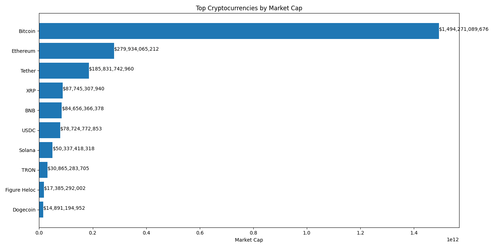
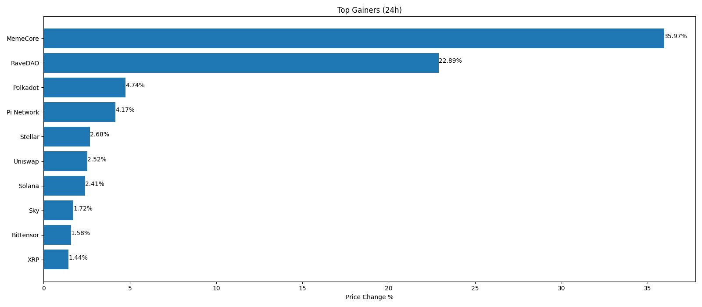
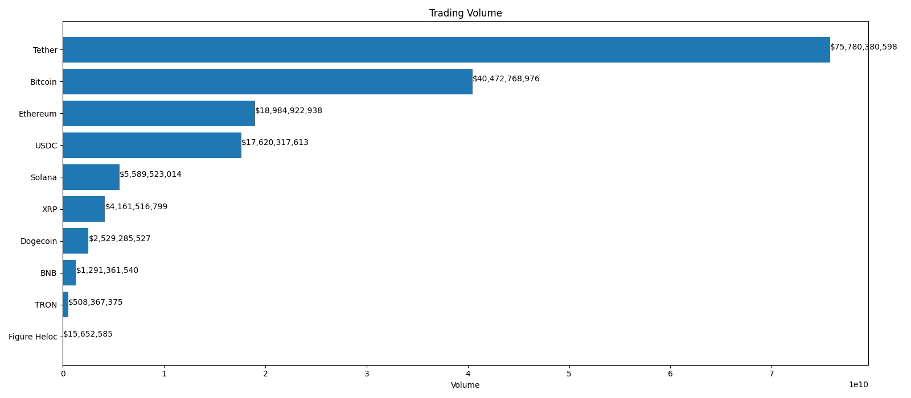
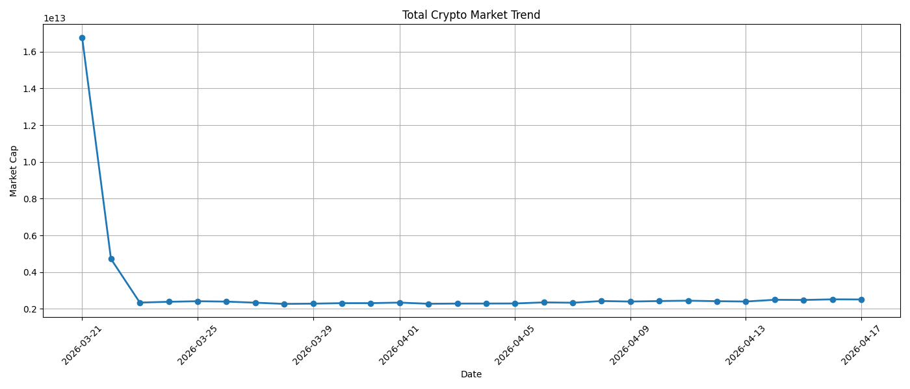

# Crypto Market API Data Analysis

This project fetches live cryptocurrency market data using an API,
performs data cleaning and analysis using Pandas, and generates
visual insights using Matplotlib.


## Project Pipeline

API → Data Cleaning → Historical Storage → Analysis → Visualization → Auto README Update

## The goal of this project is to practice working with:

- API Integration
- Data Cleaning
- Data Analysis with pandas
- Data Visualization with matplotlib

---

## Project Features

- Fetch live cryptocurrency data from API
- Convert API data into pandas DataFrame
- Clean and filter useful columns
- Analyze market trends
- Visualize insights using charts
- Save processed data locally

---

## Technologies Used

- Python
- Requests
- Pandas
- Matplotlib

---

## Project Structure

```
crypto-market-api-data-analysis
│
├── main.py
├── data
│   └── crypto_data.csv
├── charts
│   └── market_cap.png
└── README.md
```

---

## API Used

CoinGecko Public API
https://www.coingecko.com/en/api

---

## What This Project Demonstrates

This project demonstrates how to:

- Work with real-world API data
- Perform data analysis
- Build data pipelines in Python
- Create visual insights from raw data

---

## Charts Generated by the Project

### Market Cap Analysis



### Top Gainers



### Trading Volume



### Market Trend



## Sample Insights Output

Example insights generated by the program:

Top Coin by Market Cap: Bitcoin
Top Gainer Today: Solana
Highest Trading Volume: Ethereum

How to Run the Project

Clone the repository:

git clone https://github.com//crypto-market-api-data-analysis.git

Move into the project:

cd crypto-market-api-data-analysis

Install dependencies:

pip install -r requirements.txt

Run the program:

python main.py

## Future Improvements

Add historical price tracking
Automate daily data collection
Build an interactive dashboard
Add advanced data visualizations

---

## Author

Akshay


## Latest Market Snapshot

Top Coin: Bitcoin  
Top Gainer: MemeCore  
Highest Volume: Tether  
Last Updated: 2026-04-17 06:05:43
